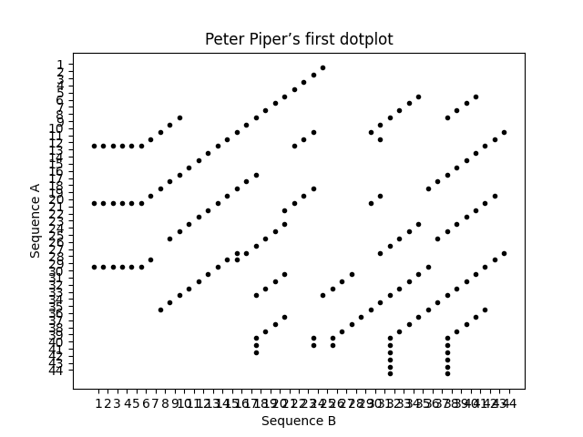
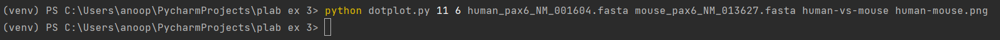
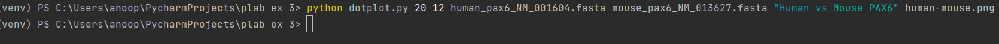
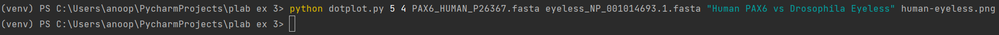

# Dotplot Generator
This script generates a dotplot from two sequences in FASTA format. The dotplot is a graphical representation of the similarities between two sequences.

# Requirements
**Python 3**

**NumPy**

**Matplotlib**

**argparse**

# Usage
```
python dotplot.py w s seqA seqB title output
```

where:

* w: window size
* s: stringency
* seqA: filename of the first sequence in FASTA format
* seqB: filename of the second sequence in FASTA format
* title: title of the dotplot
* output: output filename for the dotplot

# Output
The script generates two types of dotplots:

* ASCII dotplot: an ASCII art representation of the dotplot, saved in a text file with the extension .txt.
* Graphical dotplot: a graphical representation of the dotplot, saved in a PNG image file with the extension .png.

# Implementation
The script uses the dotplot() function to generate a matrix of ones and zeros representing the similarity between the two sequences. The dotplot2Ascii() function converts the matrix to an ASCII art representation, and the dotplot2Graphics() function plots the matrix as a scatter plot.

# Example
To generate a dotplot for two sequences seqA.fasta and seqB.fasta with window size 10 and stringency 5, and save the dotplot with the title My Dotplot and filename mydotplot, run:
```
python dotplot.py 10 5 seqA.fasta seqB.fasta "My Dotplot" mydotplot
```

# Demonstration
Visualizing Dot plots with Matplotlib in Python :



The execution of a commandline for this program, here The output of running the command ```"python dotplot.py 11 6 human_pax6_NM_001604.fasta mouse_pax6_NM_013627.fasta human-vs-mouse human-mouse.png"``` is a dotplot generated based on the two input sequences provided in FASTA format (human_pax6_NM_001604.fasta and mouse_pax6_NM_013627.fasta) with a window size of 11 and a stringency of 6. 

The resulting dotplot has a title of "human-vs-mouse" and is saved as an image file named "human-mouse.png". 

The program dotplot.py is called with the specified command-line arguments and generates the dotplot accordingly.
* 

This will generate a dot plot with window size 11 and stringency 6, with the title "human-vs-mouse" and save it as a PNG file named human-mouse.png.

the sequences in the files human_pax6_NM_001604.fasta and mouse_pax6_NM_013627.fasta, we can use the dotplot.py script and execute the following command in the terminal:

* 

This will generate a dot plot with window size 11 and stringency 6, with the title "human-eyeless" and save it as a PNG file named human-eyeless.png.

To generate a dot plot for the sequences in the files PAX6_HUMAN_P26367.fasta and eyeless_NP_001014693.1.fasta, we can use the dotplot.py script and execute the following command in the terminal:
* 
